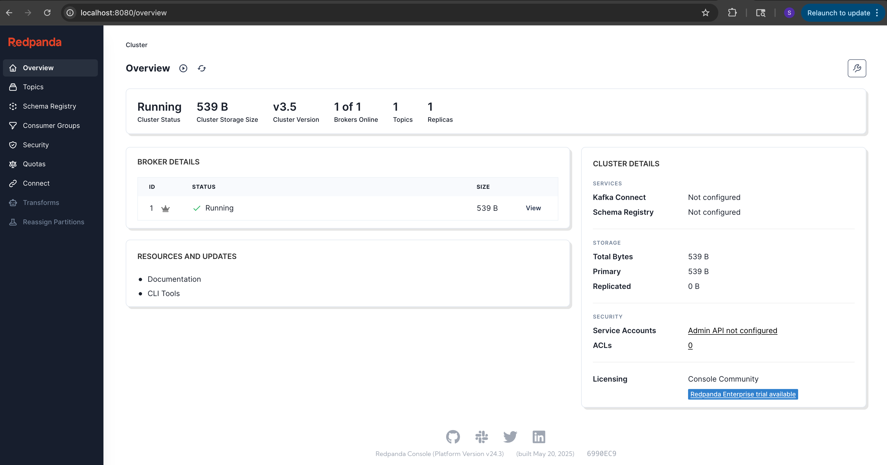
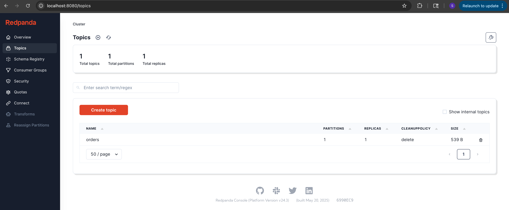
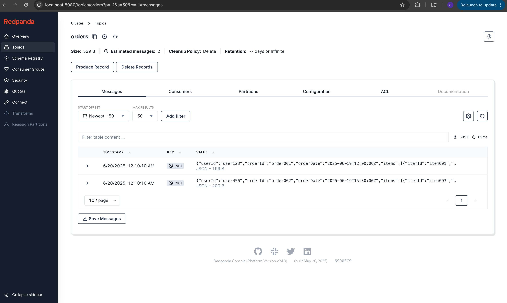

# Kafka local JSON Publisher

A lightweight Python script to publish messages from JSON file to a Kafka topic on localhost:9092.
Great for local development and testing.

## Requirements

- Python 3.7+
- Docker

## Instructions

### Install Required Python Package
Installs kafka-python package (install pipenv - pip install pipenv)

    pipenv install
    pipenv shell

### Run Kafka with Docker Compose
Starts Kafka, Zookeeper and Redpanda Console:

    docker-compose up -d

This will start:
- Kafka Broker on localhost:9092
- Zookeeper on localhost:2181
- Redpanda Console on http://localhost:8080

### Access RedPanda Console and Create a Topic
Visit:
    
    http://localhost:8080
Redpanda Console allows you to:
- Create and inspect Kafka topics
- View real-time messages
- Monitor partitions and consumer activity.

You should see the STATUS of the broker as Running in the BROKER DETAILS section at the center of the web page.

Go to `Topics` > Create `Topic` with name `orders`

### JSON File Format & Location
Your messages file should go inside the data/ folder (same directory as publish.py)

For example, you may take a look at ./data/sample-orders.json

### Run the Publisher Script

    python publish.py --file_name=sample-orders.json --topic=orders --delay=0

Arguments:
| Flag    | Description |
| -------- | ------- |
| file_name  | Name of the JSON file present in data/ folder, containing json messages to be published.    |
| topic | Name of the Kafka topic to which messages are to be published.     |
| delay    | Delay in seconds between each message. Default is zero    |

### View Messages Published on Redpanda UI

The messages published can be viewed on the redpanda UI running on `http://localhost:8080`

### STOP Docker Services
To Stop Services:

    docker-compose down

To Stop Services and remove volumes and metadata:

    docker-compose down -v
